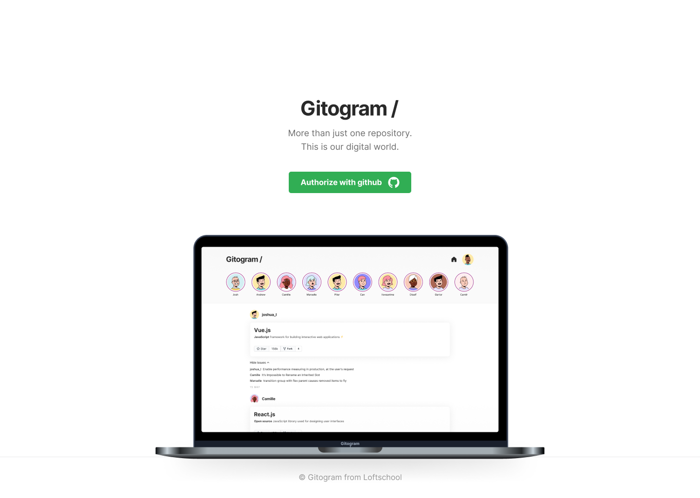
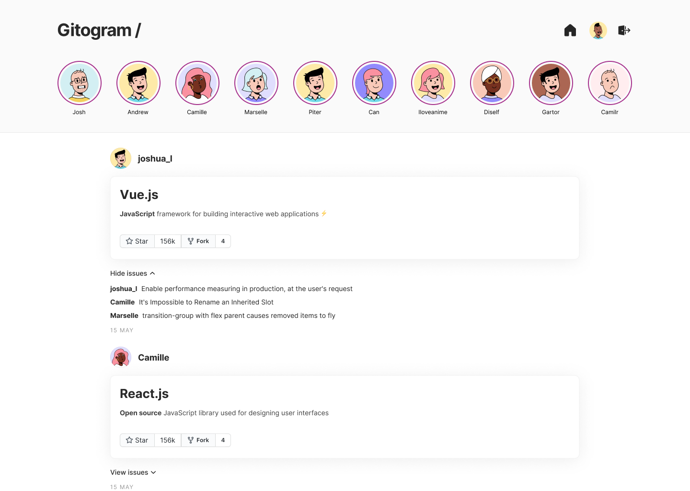
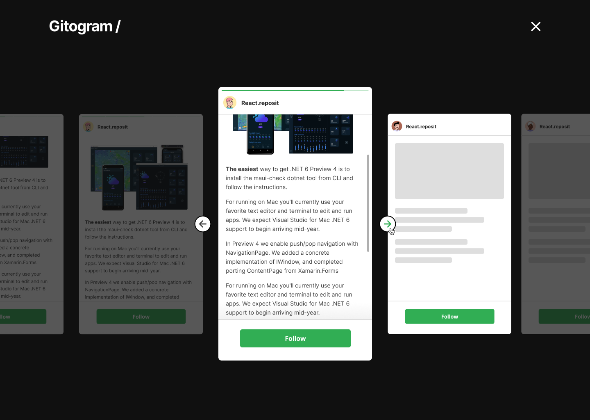

# Приложение Gitogram



## Описание

Интерфейс представляет собой приложение, взаимодействующее с github пользователя.

Авторизация реализована с помощью токенов протокола OAuth.

На главной странице три раздела:
1. Шапка с лого, переход на главную страницу, в личный кабинет (профиль и подписки) и разлогин.
2. Лента сторис с популярными репозиториями github с сортировкой по кол-ву звезд.
    При клике на сторис открывается слайдер с репозиториями и возможностью подписаться на них (Starred).
3. Лента репозиториев пользователя, отмеченных звездой (раздел Stars github) с комментариями.





## Технологии в проекте

HTML, CSS, JavaScript, Vue JS, Storybook, Vuex. Менеджер состояний, VueRouter. Роутинг в браузере

## Project setup
```
npm install
```

### Compiles and hot-reloads for development
```
npm run serve
```

### Compiles and minifies for production
```
npm run build
```

### Run your unit tests
```
npm run test:unit
```

### Run your end-to-end tests
```
npm run test:e2e
```

### Lints and fixes files
```
npm run lint
```

### Customize configuration
See [Configuration Reference](https://cli.vuejs.org/config/).
